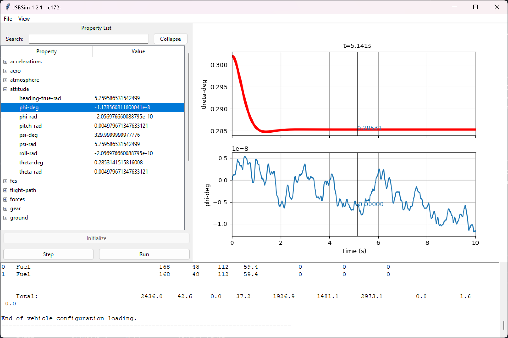

# JSBSim GUI - A Graphical User Interface for JSBSim

This project provides a graphical user interface (GUI) for interacting with the [JSBSim flight dynamics model library](https://github.com/JSBSim-Team/jsbsim). It allows users to easily configure simulations, visualize flight data, and interact with the simulation in a user-friendly way.  JSBSim GUI is written in Python and leverages the Tkinter library for the interface and [Matplotlib](https://matplotlib.org/) for visualizations.



## Current Status

This project is in its early stages of development. While the core functionality for launching simulations and displaying basic flight data is operational, the codebase is undergoing significant modifications and the API is unstable. Please be aware of potential limitations and bugs as new features are added.

## Features (Work in Progress)

* Load and configure JSBSim aircraft models
* Visualize flight data using real-time plots
* Property Explorer: A tool to navigate, display, search, and modify JSBSim properties.

## Getting Started

### Prerequisites

* Python 3.10+

### Installation

Clone the repository

```bash
git clone https://github.com/JSBSim-Team/jsbsim-gui.git
git submodule init
git submodule update
```

The project requires Python and the necessary libraries (Tkinter and Matplotlib) to be installed. You can install them using pip:

```bash
pip install -r requirements.txt
```

### Run the application

```bash
python -m src
```

## Contributions Welcome

We are actively seeking contributions from the community to improve this project. Here are some ways you can help:

* **Bug Reporting:** Encountered a bug? Please report it in the Issues section on this repository.
* **Feature Requests:** Have an idea for a new feature? Let us know in the Issues section!
* **Contribute code:** Fork the repository, make changes, and submit a pull request.
* **Improve documentation:** Help us build a comprehensive user guide and API reference.

## Technical Details

* Developed in Python
* User interface: Tkinter
* Visualization: Matplotlib
* JSBSim interaction: (details on how the GUI interacts with JSBSim)

## License

This project is licensed under the GPL3+ license.

We hope that JSBSim GUI becomes a valuable tool for the flight simulation community!
